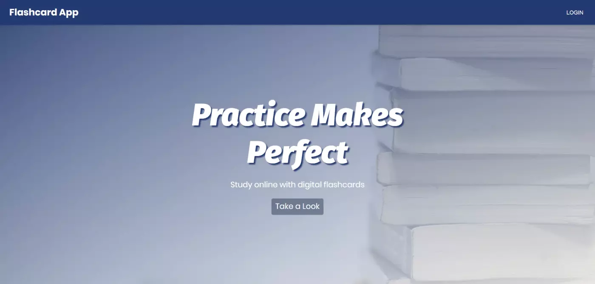

[Link](https://shrouded-taiga-52624.herokuapp.com/)

Created during Chingu Voyage, a collaborative environment where hundreds of people build projects together to learn. 
It allows users to create a topic, insert questions and answers. 
Users can only add card or delete from the topic they created, 
but they can study all the existing topics (even if they didn't create it).

###Accomplishments###
- React and Redux front-end
- Node.js and Express back-end
- Practised Git and did my first PR
- Made it responsive using media queries and refactoring CSS
- Used table and grid for layout