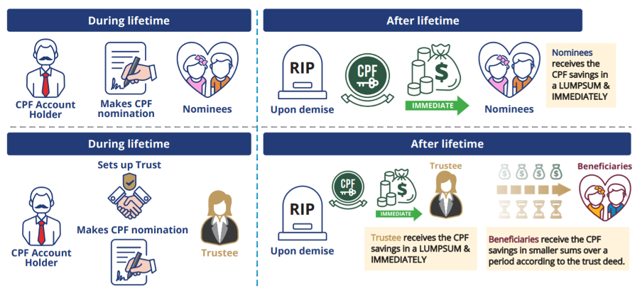

[Dev site](https://precepts.wen-pl.com/dev/), [Live site](https://app.provitrust.com/live/)

####Problem
- Client wants to create a digital trust where users can defer and stagger the payout to nominees should they deem them financially immature or vulnerable of young or elder age. 
- We use Dropbox Sign (formerly HelloSign) for e-signing. A magic link is sent to the user and they click on it to sign. However, if they click on it and remain inactive for a certain amount of time the link will expire. 
- Client wants user to be notified when the website is down for maintenance. 
- Client wants a promo code to allow users discounts of various amounts.

####Solution
- Client didn't have any hard requirements for the user interface. I did wireframe on figma with the help of our in-house designer to have an idea of the visuals.
- Superadmin can refresh signatures to ensure new magic link is being sent to the users who didn't manage to sign.
- Superadmin can create a maintenance banner from a certain time.
- Superadmin can create promo codes that can be turned on and off. Another flow has to be created for promo code.

####Stack
- Programming Languages: Typescript
- Frontend: Quasar (Vue), VueX
- Testing: Jest, Cypress for automated end-to-end testing
- Misc: Axios

#### Further reads
- How it works: 
- https://www.preceptsgroup.com/the-things-to-know-about-provitrust-series-1/