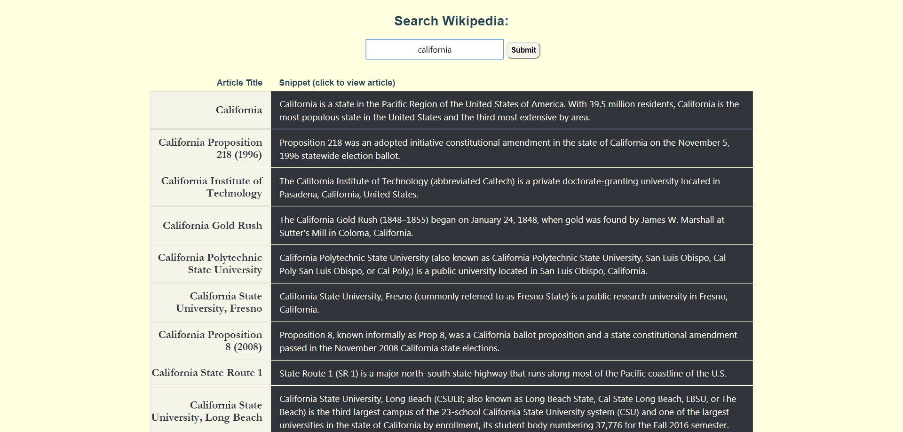

[React Wikipedia](https://jenlky.github.io/react-wikipedia/)

[Github](https://github.com/jenlky/react-wikipedia)

Searches the typed word at Wikipedia and returns the top 10 results.
When you click on any of the results, it directs you to the said result.

###Accomplishments###

- Create React App boilerplate
- Responsive and mobile friendly
- Wikipedia OpenSearch
- Used CSS grid for layout
