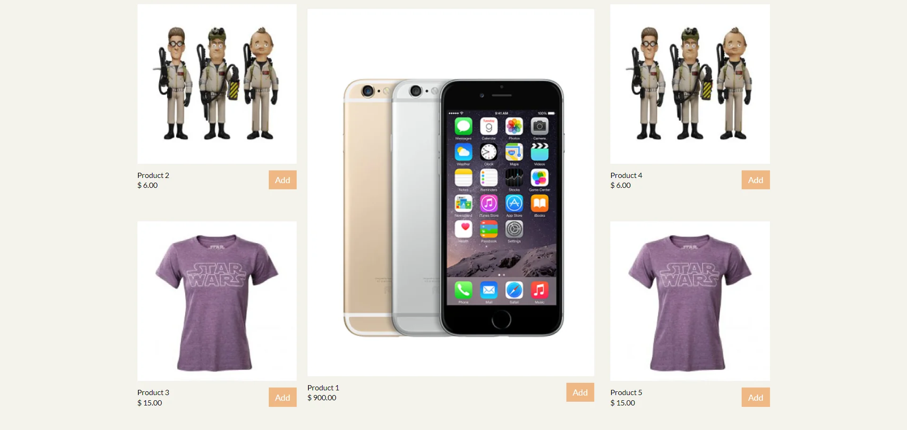

[Shoplah](https://shoplah.herokuapp.com/)

[Github](https://github.com/jenlky/shoplah)

Retrieves and displays products from Express API. Users must log in to add, remove products and change item quantity.
When user logins, retrieve added products from database. Limits access to cart, profile and checkout page to logged in users.
Displays and tallies the total quantity and price.

###Accomplishments###

- Created REST API endpoint
- Tested /GET routes
- React, Redux and Material-UI front-end
- Node.js and MongoDB back-end
- User authentication with passport.js, passport-auth0 and express-session
- Responsive and mobile friendly
- Deployed to Heroku successfully
