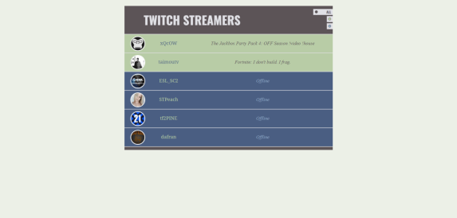

[Twitch TV](https://jenlky.github.io/twitch-tv/)

[Github](https://github.com/jenlky/twitch-tv)

Tracks twitch streamers and shows what they're streaming if they're online. Allows user to filter based on status.

###Accomplishments###

- Responsive and mobile friendly
- Consumed Twitch API
- jQuery for event handling
- Bootstrap
